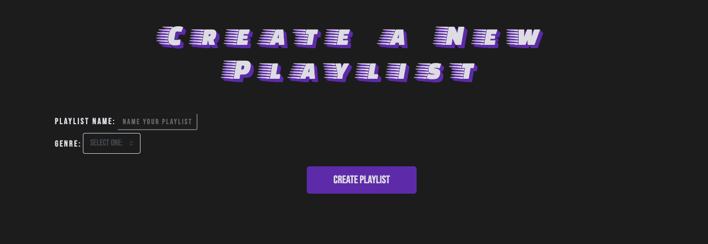

# PROJECT 1 - myTrax!

myTrax is a personalized music library, developed to utilize technologies such as **node.js**, **Express**, and **mongoDB**. In myTrax, users can input their favorite music into a library of their choosing, and rendering those songs onto their screen to listen to immediately! Utilizing the speed of Express, users can quickly and seamlessly add, view, edit, and delete their playlists as they see fit. 

---

---

### Technologies Used:

* HTML
* CSS 
* JavaScript
* Express.js
* node.js
* mongoDB
* mongoose 
* Bootstrap
* Heroku 

---

### Existing Features: 

* Users can create custom playlists, which are saved into our database.
* playlists can be populated with songs, with information provided by the user.
* If desired, a link can be added to songs, to allow them to be embedded on the page.
    * currently supported embed videos are YouTube, and Spotify.
* Users can also edit and delete playlists, as well as their songs, all on one page.

### Planned Features: 

* User authentication, allowing the creation of personalized user accounts.
    * 'liking' playlists, and being able to share them quickly on your favorite social media.
* embed integration for more sites, such as SoundCloud
* utilize Spotify to allow for users to skip the step of adding their own info

### USER STORIES

Upon loading myTrax, the user is greeted with the home page. From here, a user can use the navigation to see all current playlists, or create their own! Alternately, a user could click on the 'explore playlists' button to see all playlists currently in our database.

The main index for all playlists, this page will show the user the title of any playlists created, centered on the page inside of a table. This table will contain all playlists, and is scrollable inside of the page. From here, if a track name is moused-over and fills with a purple background, this means that link was provided for the song! If this title is clicked, then a video will be embedded on the screen inside of a modal window. Enjoy your trax! Currently, we have embed support for Youtube, and Spotify!

If a user decides that they want to simply view the playlist on it's own, they can click on the title of the playlist.

Our playlist creation is simple and easy. All you need to provide is a name for your playlist, and a genre! If you have many genres in your playlist, feel free to select 'Other' as your desired genre.

At first glance, the "show" page for a playlist seems to be very similiar to the "all playlists" page. However, from here, a user can navigate to the bottom of the screen, and either add additional songs, or edit their playlist.

When adding a song to a playlist, a user will manually enter in the info of their song, however they see fit. There are fields for **song name**, **artist**, **album**, and an optional **link**. Also included is a dropdown field at the top, which the user must use to select which playlist they want this song to enter into. 

When the button on the bottom of the "show page" called "edit playlist" is clicked, the user is directed to their playlist edit page. On this page, the power of express, node.js, and mongoose is shown off. Users can quickly and effortlessly edit their playlist info by clicking "save playlist info", and their song info on one page! You can also navigate to add more songs, or quickly delete songs, or even the playlist itself. When you are finished, click the "save playlist" button. 

### WIREFRAMES

A visual representation of our data for myTrax. We have a "one to many" relationship between our models, with the "one" being our playlists. (Users to be added in the future).

